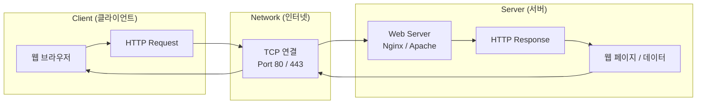
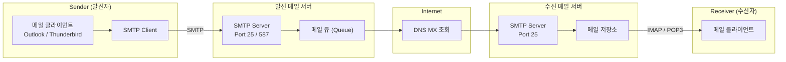

```mermaid
flowchart LR
    subgraph Client["Client (클라이언트)"]
        A["웹 브라우저"]
        B["HTTP Request"]
    end

    subgraph Network["Network (인터넷)"]
        C["TCP 연결<br/>Port 80 / 443"]
    end

    subgraph Server["Server (서버)"]
        D["Web Server<br/>Nginx / Apache"]
        E["HTTP Response"]
        F["웹 페이지 / 데이터"]
    end

    A --> B
    B --> C
    C --> D
    D --> E
    E --> F
    F --> C
    C --> A
```

```mermaid
flowchart LR
    subgraph Sender["Sender (발신자)"]
        A["메일 클라이언트<br/>Outlook / Thunderbird"]
        B["SMTP Client"]
    end

    subgraph MailServer1["발신 메일 서버"]
        C["SMTP Server<br/>Port 25 / 587"]
        D["메일 큐 (Queue)"]
    end

    subgraph Internet["Internet"]
        E["DNS MX 조회"]
    end

    subgraph MailServer2["수신 메일 서버"]
        F["SMTP Server<br/>Port 25"]
        G["메일 저장소"]
    end

    subgraph Receiver["Receiver (수신자)"]
        H["메일 클라이언트"]
    end

    A --> B
    B -->|"SMTP"| C
    C --> D
    D --> E
    E --> F
    F --> G
    G -->|"IMAP / POP3"| H
```
