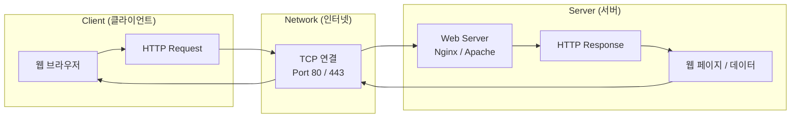

```mermaid
flowchart LR
    subgraph Client["Client (클라이언트)"]
        A["웹 브라우저"]
        B["HTTP Request"]
    end

    subgraph Network["Network (인터넷)"]
        C["TCP 연결<br/>Port 80 / 443"]
    end

    subgraph Server["Server (서버)"]
        D["Web Server<br/>Nginx / Apache"]
        E["HTTP Response"]
        F["웹 페이지 / 데이터"]
    end

    A --> B
    B --> C
    C --> D
    D --> E
    E --> F
    F --> C
    C --> A
```